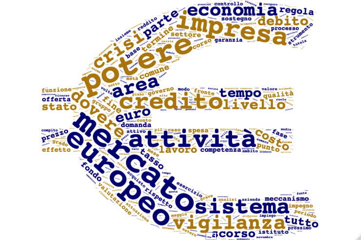

<!-- README.md is generated from README.Rmd. Please edit that file -->

```{r setup, include = FALSE}
knitr::opts_chunk$set(
  collapse = TRUE,
  comment = "#>"
)
```
# Tesi di Laurea di Paolo Dalena 

In questa *repository* sono presenti tutti i file necessari allo studio
**"TEXT MINING SU SORGENTI DI TESTO COMPLESSE: ANALISI DELLE CONSIDERAZIONI FINALI DEL GOVERNATORE SULLE RELAZIONI ANNUALI DELLA BANCA D'ITALIA DAL 2008 AL 2017"** , Tesi di Laurea in *Utilizzo Statistico di Banche Dati Economiche Online* presentata da Paolo Dalena all'appello I dell'anno accademico 2018/2019 per il Corso di Laurea in Scienze Statistiche presso l'*Alma Mater Studiorum - Università di Bologna*.

## Contenuti
Per una ragionata comprensione dei contenuti e di come questi ultimi siano stati utilizzati, si consiglia di leggere l'elaborato.

- **`Tesi`**: in formato word e pdf, nella cartella *Tesi_docs*.

- **`Dati`**: in formato pdf, così come sono stati scaricati dal [sito della Banca d'Italia](https://www.bancaditalia.it/pubblicazioni/), nella cartella *cf_pdf*; in formato txt, a seguito dell'estrazione del testo mediante il tool descritto, nella cartella *cf_txt*.

- **`Grafici`**: nella cartella *grafici*.

- **`Funzioni`**: alcune funzioni adoperate, create dal prof. Alboni per semplificare alcuni procedimenti di Text Mining, e i lexicon utilizzati per l'*opinion mining*, nella cartella *functions*.

- **`Immagini`**: utilizzate per dare forme particolari alle wordcloud, nella cartella *img*.

- **`Codice`**: organizzato (il più chiaramente possibile) per argomenti, contenente le funzioni da me create e utilizzate per l'analisi.


## Contatti

Per ulteriori chiarimenti, non esitare a contattarmi o a segnalare un problema su [github](https://github.com/PaoloDalena/tesi/issues)!